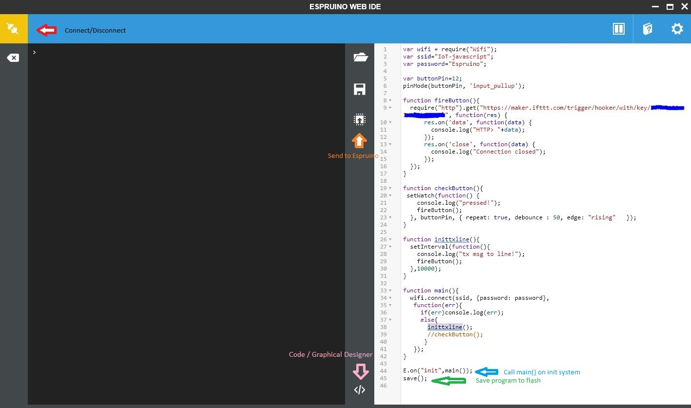

# เกริ่นนำ  
เดิมทีแล้ว Javascript นั้นมักใช้เพื่อพัฒนางานในฝั่งของ Front-end แต่ในยุคปัจจุบันได้มีการทำเครื่องมือเพื่อพัฒนาให้นักพัฒนาโปรแกรมสามารถข้าม 
platform กันได้ออกมาหลากหลายชนิดเพื่อลดเวลาในการเรียนรู้ของนักพัฒนาทั้งหน้าเก่าและหน้าใหม่ลง ไม่เว้นแต่ฝั่งของ Embedded system หรือ Internet of Things 
ก็มีคนพัฒนาโปรเจคเพื่อนำเอา Javascript มาใช้งานในอุปกรณ์ Microcontroller อยู่หลากหลายแพลทฟอม ตัวอย่างเช่น [Espruino](http://www.espruino.com), [Tessel](https://tessel.io/)
, [johnny-five](http://johnny-five.io/), [nodebots](http://nodebots.io/) เป็นต้น ในที่นี้เราจะมาเรียนรู้การใช้งาน [Espruino](http://www.espruino.com) กันดู    
  
# Espruino firmware  
เดิมทีแล้ว Espruino(software) ถูกพัฒนาให้ใช้งานบนบอร์ดฮาร์แวร์(hardware)ของตัวเอง สามารถสั่งซื้อได้จาก [link](http://www.espruino.com/Order) 
แต่ hardware ดังกล่าวไม่ได้จะได้รับความนิยมมากนัก หลังจากนั้นได้มีการพอท software ดังกล่าวให้สามารถทำงานกับ hardware ที่หลากหลายมากขึ้น 
สามารถตรวจสอบรายการของอุปกรณ์ที่ซัพพอตได้ที่ [link](http://www.espruino.com/Other+Boards)  
  
จะเห็นว่า ESP8266 เป็นฮาร์แวร์หนึ่งที่ได้รับความนิยมอย่างสูงและได้รับการซับพอทจาก Espruino โดยตรง ซึ่งภายในเว็บไซท์จะมี firmware สำหรับ ESP8266 ให้ดาว์โหลดมาใช้งานได้จากเว็บได้เลย 
ในบทความนี้จะใช้งาน ESP8266v2 ซึ่งมี Flash 4MB เป็นหลักนะครับ สำหรับ hardware รุ่นอื่นๆอาจจะต้องมีการปรับเปลี่ยนหารตั้งค่าบางอย่างบ้าง  
  
   
  
# Requirements list
1.Python3  
2.Espruino firmware for esp8266  
3.Flash firmware tools เช่น ESP8266 Download Tool, esptool.py
4.Espruino Web IDE (Chrome browser extensions)  
5.ความอยากรู้อยากลองและความสามารถในการแก้ปัญหาเฉพาะตัว  
  
## Espruino firmware for esp8266  
ขั้นแรกให้เข้าไป Download Espruino firmware มาจาก [official](http://www.espruino.com/Download) ก่อนครับ 
เลือก version ตามที่ชอบเลย(ตัว stable ที่ใหม่สุดนั่นแหละ) ของผมจะเลือกเป็น [1v93](http://www.espruino.com/files/espruino_1v93.zip) 
มาใช้งานครับ  

เมื่อดาว์โหลดลงแล้วให้ทำการแตกไฟล์ .zip ออกมาก็จะพบว่ามี firmware หลายตัวให้เลือกใช้ซึ่งก็จะต้องเลือกให้ตรงกับฮาดแวร์ที่ใช้ครับ  
```
.
├── changelog.txt
├── espruino_1v93_esp32
│   ├── bootloader.bin
│   ├── espruino_esp32.bin
│   ├── partitions_espruino.bin
│   └── README_flash.txt
├── espruino_1v93_esp32.bin
├── espruino_1v93_esp8266
│   ├── blank.bin
│   ├── boot_v1.6.bin
│   ├── esp_init_data_default.bin
│   ├── espruino_esp8266_user1.bin
│   ├── espruino_esp8266_user2.bin
│   ├── README_flash.txt
│   └── wiflash.sh
├── espruino_1v93_esp8266_4mb
│   ├── blank.bin
│   ├── boot_v1.6.bin
│   ├── esp_init_data_default.bin
│   ├── espruino_esp8266_user1.bin
│   ├── espruino_esp8266_user2.bin
│   ├── README_flash.txt
│   ├── _temp_by_dltool
│   │   └── downloadPanel1
│   │       ├── boot_v1.6.bin_rep
│   │       ├── esp_init_data_default.bin_rep
│   │       └── espruino_esp8266_user1.bin_rep
│   └── wiflash.sh
├── espruino_1v93_esp8266_4mb_combined_4096.bin
├── espruino_1v93_esp8266_combined_512.bin
├── espruino_1v93_espruino_1r3.bin
├── espruino_1v93_espruino_1r3_wiznet.bin
├── espruino_1v93_hystm32_24_ve.bin
├── espruino_1v93_hystm32_28_rb.bin
├── espruino_1v93_hystm32_32_vc.bin
├── espruino_1v93_microbit.hex
├── espruino_1v93_nucleof401re.bin
├── espruino_1v93_nucleof411re.bin
├── espruino_1v93_olimexino_stm32.bin
├── espruino_1v93_pico_1r3_cc3000.bin
├── espruino_1v93_pico_1r3_wiznet.bin
├── espruino_1v93_puckjs.zip
├── espruino_1v93_raspberrypi
├── espruino_1v93_ruuvitag.zip
├── espruino_1v93_stm32f3discovery.bin
├── espruino_1v93_stm32f4discovery.bin
├── espruino_1v93_stm32vldiscovery.bin
├── espruino_1v93_wifi.bin
├── functions.html
├── licences.txt
└── readme.txt
```
ในที่นี้ผมจะใช้ไฟล์ที่อยู่ใน folder espruino_1v93_esp8266_4mb นะครับ  

## การ Flash Espruino firmware ลงบนบอร์ด  
หากท่านใช้งาน `esptool.py` สามารถอ่านขั้นตอนได้จากไฟล์ `espruino_1v93_esp8266_4mb/README_flash.txt` ได้เลยครับ  
หากท่านใช้ tools อื่นๆสามารถดูตัวอย่างการตั้งค่าได้จากในรูปด้านล่างซึ่งใช้ ESP8266 Download Tool เลย 
หลังจากตั้งค่าให้เหมือนตามรูปเสร็จก็กดปุ่ม START ด้านล่างซ้ายเลยครับ  
  
  
  
เมื่อแฟรช firmware เสร็จแล้ว(Download Panel 1 ขึ้นสีเขียวพร้อมคำว่า Finish) ให้ทำการกดปุ่ม reset ที่อยู่บนบอด ESP8266v2 ครั้งนึง
(Flash tool อื่นบางตัวอาจจะต้องตัดไฟบอร์ดด้วย) ก็จะสามารถติดต่อ Javascript console ผ่าน Serial port terminal ต่างๆเช่น putty ได้เลยครับ
ให้ตั้งค่า `Baud rate=115200` แล้วทดสอบด้วย javascript syntax ได้เลยเช่น
```
>1+1
=2
>a = "Hello Expruino"          
="Hello Expruino"
>console.log(a)
Hello Expruino
=undefined
>(new Uint8Array([1,2,3])).forEach(function(value) { console.log(value);});
1
2
3
=undefined
>
```
  
เราสามารถตรวจสอบ memory ของระบบได้โดยการใช้คำสั่งดังนี้  
```
>process.memory()
={ "free": 1547, "usage": 53, "total": 1600, "history": 39 }
```

## ติดตั้ง Espruino Web IDE (Chrome browser extensions)  
เปิด Google Chrome browser ขึ้นมาและเค้นหาด้วยคำว่า `Espruino Web IDE chrome.google.com` หรือ [click แรงๆ](https://chrome.google.com/webstore/detail/espruino-web-ide/bleoifhkdalbjfbobjackfdifdneehpo) จากนั้นให้ทำการติดตั้งให้เรียบร้อย  
  
  
  
เปิดโปรแกรม Espruino Web IDE ขึ้นมาและคลิ๊กเข้าไปที่ Settings(รูปเฟื้องบริขวามือบน) และตั้งค่า Baud rate ให้เท่ากับ 115200 ตามรูปก็เสร็จสิ้นการตั้งค่าเรียบร้อย  

  
  
ปิดโปรแกรม Serial port terminal อื่นๆให้หมด และทำการ connect โดยการกดปุ่มรูปปั๊กส้มๆด้านบนซ้ายและเลือก COM PORT ที่ใช้งาน   

  
  
หลังจากขั้นตอนนี้เราก็จะสามารถใช้งาน Espruino javascript console ผ่านโปรแกรม Espruino Web IDE ได้แล้ว ซึ่งเราสามารถเขียนโปรแกรมฝั่งและสั่งลงไปรันบนบอร์ดได้ด้วยปุ่ม Send to Espruino  
  
นอกจากนี้ยังมีโหมดการออกแบบโรปรแกรมด้วย Graphical Designer ซึ่งจะคล้ายๆกับ [SCRATCH](https://scratch.mit.edu/) ของ MIT ที่ออกแบบไว้สำหรับสอนเด็กๆอายุ 8-16 ขวบเขียนโปรแกรมด้วยครับ  
  
  
  
สามารถแสดงสถานะ memory ปัจจุบันได้ด้วยการใช้คำสั่ง `process.memory()` ลงใน serial port terminal  
  
  
## Examples
| Title     							              	      | Description        											                              |
|-----------------------------------------------|-----------------------------------------------------------------------|
| [Blink](esp8266v2/blinkled.js)     				                                 | A simple example to blink LED in **memory**(not save flash)                	|
| [WiFi Clinet](esp8266v2/wificlientWithBlink.js)     				                 | A simple example to **connect** to a **Wi-Fi AP** and make the NodeMCU board available through **espruino.local**                   	|
| [DHTxx: Humidity&Temperature](esp8266v2/humidityTemperatureDHTxxModule.js)     	 | Humidity&Temperature sensor module to be json string           |


สำหรับตัวอย่างการใช้งานเพิ่มเติมสามารถดูเพิ่มเติมได้ที่ [Official Link](https://www.espruino.com/Tutorials) ครับ  

