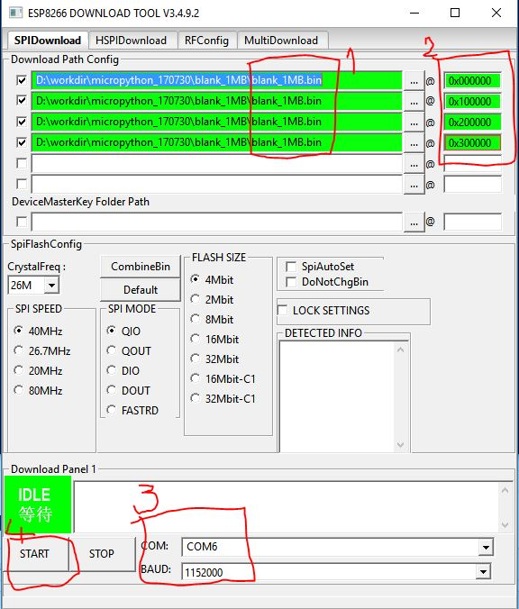
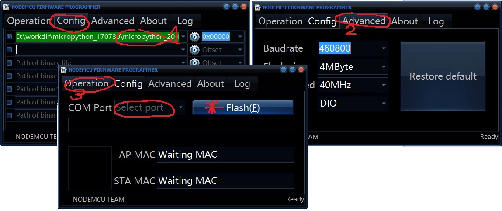
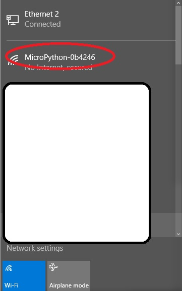
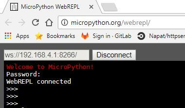

# Python  
เป็นภาษาที่ได้รับความนิยมอย่างสูงเนื่องจากตัวภาษานั้นเข้าใจได้ง่าย Learning curve ต่ำและมีไลบรารี่ให้มากมายในหลากหลายสาขา ในปัจจุบันจึงมีการดึงเอา Python มาตรฐานมาตัดแต่งบางส่วนออกไปให้เหมาะสมกับทรัพยากรที่ microcontroller มีอยู่ซึ่งรู้จักกันในชื่อ [MicroPython](https://micropython.org/)  

# MicroPython
ซัพพอตบอดมาตรฐานที่ได้รับความนิยมอย่างมากเช่น ESP8266 และ[อื่นๆ](https://micropython.org/download#other)  
หลังจากติดตั้ง MicroPython ลงใน microcontroller board เช่น ESP8266 แล้ว เราจะสามารถติดต่อกับ *python interactive prompt* ผ่าน serial port เพื่อรันคำสั่งทีละบรรทัดแบบ python shell ได้ทันที  
นอกจากนั้นเรายังสามารถนำเอา python script ที่เป็นไฟล์ลงไปรันในบอดได้แต่จะต้องติดตั้ง tools เพิ่มเติมเช่น [amphy](https://github.com/adafruit/ampy) , [mpfshell](https://github.com/wendlers/mpfshell)    

# ESP8266 get start
## MicroPython firmware(binary at official website) 
Newbie step  
1. เข้าไปที่ https://micropython.org/download, select board [ESP8266](https://micropython.org/download#esp8266).
กด download .bin file ที่ต้องการมาเก็บไว้  
  
2. สำหรับผู้ใช้งาน Windows ที่ชอบใช้ gui tools เช่น [ESP8266Flasher](https://github.com/nodemcu/nodemcu-flasher/tree/master/Win64/Release) ในการ flash โปรแกรมนั้น ก่อนจะติดตั้ง micropython ลงบน ESP8266 ควรจะต้องลบ flash memory ซะก่อน [erase ESP8266 flash memory](http://www.pratikpanda.com/completely-format-erase-esp8266-flash-memory/)    
โดยเฉพาะบอดที่เคยถูกแฟลชโปรแกรมใหญ่ๆลงไปมักจะพบปัญหาหลังจากโปรแกรม micropython เข้าไป     
ในที่นี้จะใช้โปรแกรม [ESPFlashDownloadTool](https://espressif.com/en/support/download/other-tools) และ binary `blank_1MB.bin` เพื่อล้างโปรแกมเก่าออกจาก ESP8266  
เนื่องจาก ESP8266 ในที่นี้มี flash memory ขนาด 4MB ดังนั้นจะต้องทำการแฟลช `blank_1MB.bin` ลงไปยังตำแหน่ง address offset 0x000000, 0x100000, 0x200000 และ 0x300000 ดังรูป  
  
  
  
3. ขั้นตอนการแฟลช binary ของ micropython ลงบน ESP8266 สามารถทำให้หลายวิธี   
3.1 สำหรับผู้ใช้ Linux แนะนำให้ใช้วิธีโปรแกรมด้วย esptool.py ซึ่งเป็น python module 
สามารถลงผ่าน pip ด้วยขั้นตอนในลิงค์ official [the tutorial](http://docs.micropython.org/en/latest/esp8266/esp8266/tutorial/intro.html#deploying-the-firmware) ได้เลย    
3.2 สำหรับผู้ใช้ Windows มีโปรแกรมให้เลือกใช้หลากหลาย เช่น   
3.2.1 ใช้ esptool.py เหมือนของ linux ซึ่งจะต้องลง python ในเครื่องด้วย  
ซึ่งอาจจะลำบากนิดนึงสำหรับผู้ไม่ชอบ command line (ทำใจซะยังไงเดี๋ยวก็ต้องใช้)   
หรือไม่เคยใช้ python มาก่อน (แต่นี่เรากำลังจะใช้ micropython กันนะ อย่าไปกลัว!!)   
3.2.2 ใช้โปรแกรม [ESP8266Flasher](https://github.com/nodemcu/nodemcu-flasher/tree/master/Win64/Release) ส่วนตัวแนะนำให้ใช้โปรแกรมนี้เนื่องจากง่ายสำหรับผู้ใช้ทุกระดับ   
   
  
   
3.2.4 ใช้โปรแกรม [ESPFlashDownloadTool](https://espressif.com/en/support/download/other-tools) ที่ใช้ในขั้นตอนลบ flash นั่นแหละ **แต่ผมลองใช้โปรแกรมนี้ flash micropython ลง ESP8266 แล้วไม่มันเวิกแฮะ??? จริงๆก็ควรจะใช้ได้นะ อาจจะตั้งค่าอะไรผิดไป ช่างมันเถอะ**  
4. หลังจากโปรแกรมเสร็จเรียบร้อยให้ทำการปิดโปรแกรมที่ใช้แฟลชให้หมด(เพื่อการันตีว่าไม่มีใครใช้ serial port แล้ว)  
จากนั้นใช้โปรแกรม serial port terminal ต่างๆเช่น putty/Xshell/...  
ตั้งค่า baud rate: 115200 และเิร่มการคุย serial port เพื่อเข้าสู่ MicroPython prompt  
เราจะเรียกโหมดนี้ว่า REPL(Read Evaluate Print Loop) ซึ่งเราสามารถตรวจสอบความสมบูรณ์ของ MicroPython firmware ได้ดังนี้  
```
>>> import esp
>>> esp.check_fw()
size: 612028
md5: 7653de1969a66ed01e27fd3b18b71aa6
True
>>> print("Hello World!")
Hello World!
>>> import sys
>>> print (sys.version)
3.4.0
>>> 
```

# ทำความเข้าใจ MicroPython boot sequence แบบรวดเร็ว  
1. โปรแกรม boot.py(ไฟล์นี้จะมีอยู่แล้วใน default firmware) จะถูกรันเป็นไฟล์แรกเมื่อ power on  
2. โปรแกรม main.py จะถูก execute โดยอัตโนมัติหลังจากจบการทำงานของ boot.py เราสามารถใส่ไฟล์ main.py นี้เข้าไปในบอดได้ด้วย ampy ซึ่งจะกล่าวถึงในขั้นตอนถัดไป  

# [Ampy](https://github.com/adafruit/ampy)  
คือเครื่องมืออย่างง่ายสำหรับติดต่อกับ MicroPython board เช่น put/get/run sourcecode.py ผ่าน serial connection  
Note: Advance tool/Advance user อาจจะไปใช้ [mpfshell](https://github.com/wendlers/mpfshell) ซึ่งมีความสามารถสูงกว่าเช่น   
ซับพอตการสื่อสารผ่าน serial line/Websockets(ESP8266) และ Telnet(สำหรับ WiPy borad)  

1. Install python to your host(PC/Notebook)  
2. Install ampy to your host by user pip  
**Windows user ควรรัน cmd ด้วยสิทธิของ administrator**  
```
# windows with python2
> pip install adafruit-ampy

# windows with python3
> pip3 install adafruit-ampy

# other platform see: https://github.com/adafruit/ampy
```
```
> pip list
adafruit-ampy (1.0.1)
click (6.7)
ecdsa (0.13)
esptool (2.0.1)
pip (9.0.1)
pyaes (1.6.0)
pyserial (3.4)
setuptools (36.2.7)
wheel (0.29.0)
```
3. ตรวจสอบการติดต่อสื่อสารกับ board ด้วยการแสดง python script ที่อยู่บน board   
สำหรับผู้ใช้งาน Windows ให้ทำการตั้งค่า env ก่อนเพื่อการใช้งานที่ง่าย  
**อย่าลืมปิดโปรแกรมอื่นๆที่ใช้ Serial port** ก่อนรัน ampy  
```
# Windows user please set env to select comport
> set AMPY_PORT=COM6

# list all files in your board
> ampy ls
boot.py

```
3. ทดสอบคำสั่ง ampy put / run / get
ทำการเขียนโปรแกรมไฟกระพริบ (demo_led.py) ให้เสร็จ จากนั้นทำการทดสอบเอาโปรแกรมไปรันบนบอดดังนี้ 
ตัวอย่างโปรแกรม demo_led.py
```
$ cat demo_led.py  # หรือ type demo_led.py สำหรับ Windows user
#
# micropython use gpio port number in sourcecode 
# from esp8266 link: https://github.com/nodemcu/nodemcu-devkit
# you will found that led on board is plug with GPIO16
#

from machine import Pin
import time

_led = Pin(16,Pin.OUT,value=1)
_state = 0
for i in range(10):
	_state = not _state
	_led.value(_state)
	time.sleep(1)

```
ทดสอบส่งโปรแกรมเข้าไปในบอดและรันโปรแกรมด้วยคำสั่งดังนี้  
```
$ ampy ls
boot.py
$ ampy put demo_led.py
$ ampy ls
boot.py
demo_led.py
$ ampy run demo_led.py
```

สำหรับการดึงไฟล์จาก board มาไว้ในเครื่องเราจะใช้ทริกนิดหน่อยดังนี้  
```
ampy get boot.py > boot.py
```

# การเปิดใช้งาน  Webrepl และตั้งค่า password [Ref](https://learn.adafruit.com/micropython-basics-esp8266-webrepl/access-webrepl)
โดย default แล้ว WbREPL จะถูกปิดอยู่ เราจะต้องใช้ REPL ในการตั้งค่าซะก่อนดังนี้  
```
>>> import webrepl_setup
WebREPL daemon auto-start status: disabled

Would you like to (E)nable or (D)isable it running on boot?
(Empty line to quit)
> E
To enable WebREPL, you must set password for it
New password: password
Confirm password: password
Changes will be activated after reboot
Would you like to reboot now? (y/n) y

```
หลังจาก reboot เสร็จจะมี wifi radio ขึ้นมาชื่อ `MicroPython-xxxxxx` ให้ใช้ password: **micropythoN** เพื่อ connect wifi ดังกล่าว  
  
  
  
สำหรับการติดต่อเข้าไปยัง Webrepl ของ esp8266 นั้นจะวิ่งผ่าน websocket ดังนั้นเราจำเป็นจะต้องมีโปรแกรม client เพื่อติดต่อเข้าไป
1. ในกรณีที่ host(PC/Notebook) ของเรายังวิ่งออก internet ได้ (เช่นออก internet ผ่านสาย lan & wifi ต่อเข้า MicroPython-xxxxxx)  
สามารถใช้ online client [click](http://micropython.org/webrepl/) ได้เลย  
  
   
  
2. ในกรณีที่ต่อ Internet พร้อมกับ connect wifi MicroPython-xxxxxx ไม่ได้ จะต้องติดตั้ง client อื่นเพิ่มเติมก่อน เช่น [micropython/webrepl](https://github.com/micropython/webrepl) , [mpfshell](https://github.com/wendlers/mpfshell) 
ตัวอย่างขั้นตอนการใช้ webrepl แบบรวดเร็วใน 3 ขั้นตอน  
1. Download https://github.com/micropython/webrepl/archive/master.zip  
2. Connect wifi MicroPython-xxxxxx  
3. Extract .zip และ เปิดไฟล์ webrepl.html ด้วย Chrome หรือ Firefox browser  
จบ  

# การตั้งค่า  WIFI Access Point (AP) name และ password ใหม่  
ชื่อ Default AP จะอยู่ในรูปแบบ `MicroPython-xxxxxx` และ password คือ  `micropythoN`  
เราสามารถตั้งค่าใหม่ได้ดังนี้  
```
>>> import network;
>>> ap = network.WLAN(network.AP_IF);
>>> print(ap.config('essid'));
MicroPython-0b4246
>>> ap.active(True);
>>> ap.config(essid='MyNewESP8266', authmode=network.AUTH_WPA_WPA2_PSK, password='mynewpassword');
>>> print(ap.config('essid'));
MyESP8266
>>> 
```

# Trick การเขียนโปรแกรม
## การ porting libs
- สามารถไปดู sourcecode จากใน python ตัวปกติว่าเขียนยังไงแล้วนำมาใช้ได้นะ
- จะอัปเดท application(เช่น main.py) ผ่าน internet ใช้ ampy คงไม่ไหว ต้องไปใช้ [mpfshell](https://github.com/wendlers/mpfshell)    
ซึ่งจะต้อง enable webrepl ก่อนนะ     
- โปรแกม a.py สามารถเขียนโปรแกรม write b.py ไปตรงๆได้เลยเช่น 
```
fo = open("foo.txt", "w")
fo.write( "Python is a great language.\nYeah its great!!\n")
fo.close()
```
ดูแล้วเป็นอะไรที่ดูเปิดกว้างมาก การอัปเกรด firmware สามารถทำได้ง่ายๆแต่ก็กลายเป็นความเสี่ยงที่จะถูก hack ได้ง่ายๆเช่นกัน ต้องระวังการถ้าโดนเข้าถึง webrepl ให้ดีๆเลย **ต้องตั้งค่า password ให้แข็งแรงเลยนะ**  
สามารถตั้งเค่า password ใหม่ได้ดังนี้
```
import webrepl
webrepl._webrepl.password("yourNewPassword")
```

# คำถาม   
- ทำเป็น bootloader ช่วยอัปเกรด partition MicroPython ทั้งก้อนได้มั้ย?  
--:> คงต้อง compile micropython เองเลยแหละมั้ง     
  
- source code .py สามารถแปลงเป็น binary ให้อ่านไม่ออกได้มั้ยเนี่ยะ?  
--:> python obfuscation น่าจะพอช่วยได้หน่อย   

- มี wathdog api รึเปล่า  
--:> เหมือนบาง hardware เช่น esp8266 จะยังมีปัญหาเรื่องนี้อยู่นะ   
- เขียน c เพื่อสร้างเป็น libs ให้ใช้ได้มั้ยหนอ?   
--:> ยังไม่ได้หา
